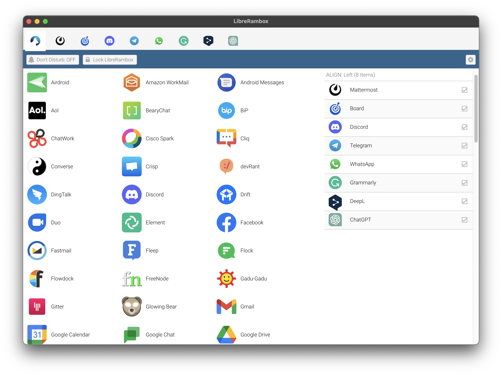

<div align="center">
  <h1>
    <br />
    <a href="https://rambox.pro"></a><br />
    LibreRambox
    <br /><br/>
  </h1>

  <h4>Unleash Seamless Communication: The Ultimate Open-Source Messaging & Emailing Fusion.</h4>

  <p>
    <a href="https://www.gnu.org/licenses/gpl-3.0.en.html" target="_blank"></a>
    <a target="_blank" href="https://crowdin.com/project/rambox"></a>
  </p>
	<p>
		<a target="_blank" href="https://github.com/LibreRambox/LibreRambox/releases"> </a>
	</p>
  <p>
    
  </p>

  <h5>Available for Windows, Mac and Linux.</h5>

  <h5><a href="https://github.com/LibreRambox/LibreRambox/releases" target="_blank"></a></h5>

  <h6>Logo designed by <a href="https://www.linkedin.com/in/andriyyurchenko/" target="_blank">Andriy Yurchenko</a></h6>
</div>

---

## Table of Contents

- [Screenshot](#screenshot)
- [Apps available](#apps-available)
- [Features](#features)
- [Privacy](#privacy)
- [Translations](#translations)
- [Install on Linux - Steps](#install-on-linux---steps)
- [Contributing](#contributing)
  - [Quickstart](#quickstart)
- [Disclosure](#disclosure)
- [Licence](#licence)

---

## Screenshot



## Apps available

Visit our website https://rambox.app/#apps and select the "LibreRambox" filter to see all the apps available.

## Features

- [x] Multi-language.
- [x] Sync your configuration between multiple computers.
- [x] Master Password.
- [x] Lock Rambox if you will be away for a period of time.
- [x] Don't disturb mode.
- [x] Reorder applications in the tab bar.
- [x] Notification badge in the tab.
- [x] Minimize to tray.
- [x] Mute audio to specific service.
- [x] Separate tabs floating to the right.
- [x] Disable a service instead of remove it.
- [x] Start automatically on system startup.
- [x] Custom Code Injection.
- [x] Keyboard Shortcuts.
- [x] Proxy.
- [x] Switch from horizontal to vertical tab bar.

## Privacy

No personal information will be saved

Sessions will persist using the [partition:persist](https://electronjs.org/docs/api/webview-tag#partition) attribute for Webviews.
So every time you open Rambox, your sessions will keep alive until you remove the service.

Sync feature use Auth0 for Single Sign On & Token Based Authentication and to store the services that user is using (and the configuration for each service).
You are always welcome to check the code! ;)

## Translations

Help us translate Rambox on <https://crowdin.com/project/rambox/invite>.

## [Install on Linux - Steps](https://github.com/ramboxapp/LibreRambox/wiki/Install-on-Linux)

## [Contributing](./CONTRIBUTING.md)

Want to report a bug, request a feature, contribute to or translate Rambox?
We need all the help we can get!
Fork and work!

### Quickstart

```shell
git clone https://github.com/LibreRambox/LibreRambox.git
cd LibreRambox
npm install
sencha app watch
npm start
```

See [Contributing.md](./CONTRIBUTING.md) for more detailed information about getting set up.

---

## Disclosure

LibreRambox is not affiliated with any of the messaging apps offered.

## Licence

[GNU GPL v3](https://github.com/LibreRambox/LibreRambox/blob/master/LICENSE)
